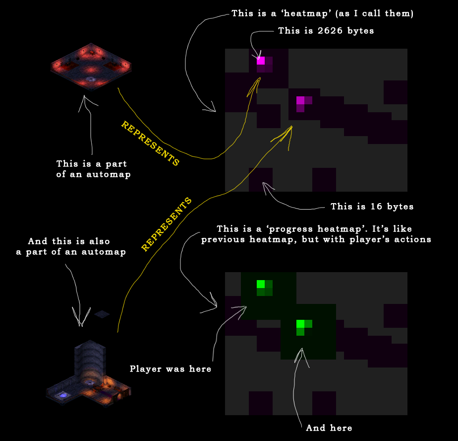
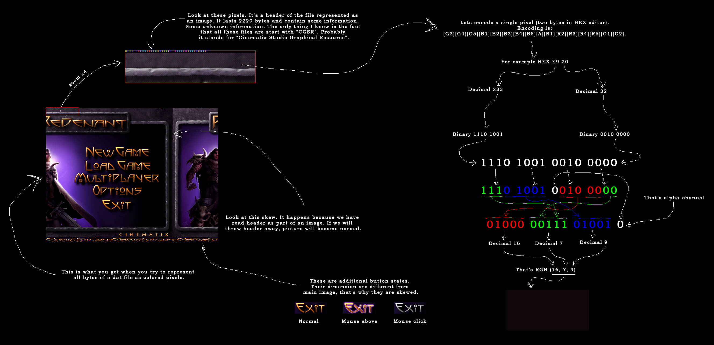
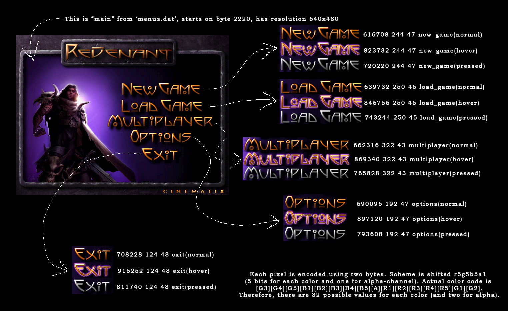

# Revenant

Set of tools created to interact with Revenant content
(RPG game by Cinematix studios, released in 1999 by the publisher Eidos
Interactive).

## Before you start

All scripts in this repository are supposed to be launched using Python 3.
Preferable Python 3.8. Python must be added to PATH (you will be asked about
this during installation of the python interpreter).

Basic setup for the start using command line:

```shell
git clone git@github.com:IgorZyktin/Revenant.git
cd Revenant
python -m vitualenv venv
pip install -r requirements.txt
cd revenant
```

If you do not have GIT installed, you can just download source as zip file from
[here](https://github.com/IgorZyktin/Revenant/archive/refs/heads/master.zip)
and unpack it to the Revenant folder manually.

If you do not have virtualenv installed, you can install it by calling:

```shell
pip install virtualenv
```

## Map processing

When you play Revenant, that small map in lower right corner of the screen is
called automap. Automap is built out of small *.bmp files located in the module
file. This script is stitching that small files into a single big image.



### Automaps

Save automaps from given directory:

```shell
python automaps.py automaps somefolder
```

Save all automaps from all nearby directories:

```shell
python automaps.py automaps *
```

### Heatmaps

Whole game world in Revenant is built like a mesh out of small *.dat files.
Each map file contains data about any objects located there. When you play the
game, all changes in game world (all differences from original map *.dat files)
 are saved in your savegame directory. Unfortunately, original map files were
created in proprietary format. Therefore, heatmaps are the best we could get
out of them. Heatmap is built based on size of the files. Bigger the file,
brighter the tile it represents.

Save heatmaps from given directory:

```shell
python automaps.py heatmaps somefolder
```

Save all heatmaps from all nearby directories

```shell
python automaps.py heatmaps *
```

### Player's progress

Same as heat maps, but for specific player. At first this script creates
heatmaps for default game world (without changes by player). Since all saves in
Revenant are built upon creating lots of specific *.dat files, that represent
player's actions , it is possible to show that difference graphically. Progress
heatmap will show you where's the most difference in file sizes. And that
difference represents already visited places in game world.

Write player's progress over default game map:

```shell
python automaps.py progress source_dat_folder player_dat_folder
```

## Images processing

Game uses strange color encoding system, similar to r5g5b5a1 (five bits for
color and on for alpha channel). But encoding bits are shifted for some reason.



Real ingame color format is:

```
[G3][G4][G5][B1][B2][B3][B4][B5][A][R1][R2][R3][R4][R5][G1][G2]
```

For example:
red 0000000001111100 green 1110000000000011 blue 0001111100000000

Each file also contains header with technical information. Contents of the
header are unknown. For example, "loadgamealpha.dat" has 616 560 bytes. We know
that it contains 640x480 pixels image, with two bytes for pixel. Therefore, it
has 640 x 480 x 2 bytes = 307 200 x 2 = 614 400 bytes. File size is 616 560
bytes, therefore header is 616 560 - 614 400 = 2160 bytes. If you start to read
from 2160 byte, you get colors of the pixels. Note that this counts only for
dat files in "resources" directory! Game uses two completely different types of
encoding for *.dat files. Files in 'resources' folder are related to 2D images.
Files in 'maps' folder are related to game levels and have much more
complicated structure.



Save single dat file as bmp file:

```shell
python images.py extract somefile.dat
```

Save all dat files in current directory as bmp files (including sub folders):

```shell
python images.py extract *
```

Merge existing bmp files into existing dat file:

```shell
python images.py insert somefile.dat
```

If it's a single image, you'll need somefile_main.bmp. If dat file requires
more than one file, then you need to create sequence. The Simplest way to do
that - extract with dat_to_bmp func, change files you need, and repack it back.
